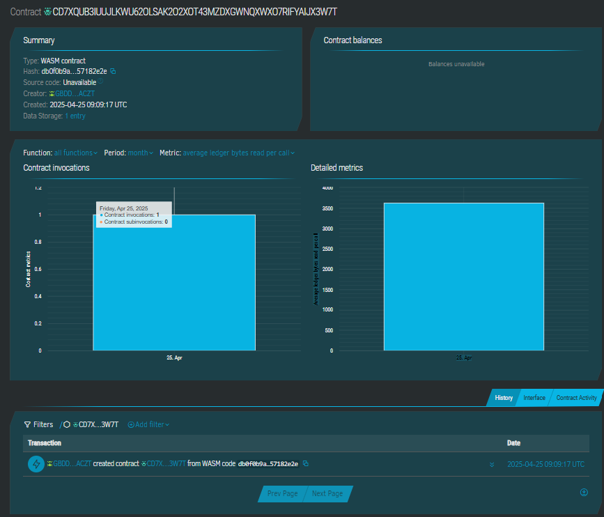

# Language Learning Through Immersive Videos

## 📘 Project Description

This project leverages blockchain-based smart contracts to log and track progress in language learning through immersive video sessions. Each learning session is stored immutably, ensuring transparency and traceability of educational progress for learners, educators, and platforms.

## 🌟 Project Vision

Our goal is to enhance the language acquisition experience by merging immersive multimedia with decentralized technology. This approach empowers learners to build consistent habits while providing immutable proof of participation and progress.

## 🔑 Key Features

- **Session Creation**: Users can log new video-based learning sessions tied to a specific language and content title.
- **Progress Tracking**: Mark individual sessions as completed to track learning consistency.
- **Immutable Logs**: Each session is stored on the blockchain for auditability and transparency.
- **Efficient Storage**: Lightweight and optimized for quick read/write operations.

## 🔮 Future Scope

- **NFT-based Certifications**: Reward learners with on-chain certificates for milestones.
- **Analytics Dashboard**: Visualize language learning journey with graphs and insights.
- **Multimedia Integration**: Sync with IPFS or similar systems to directly reference video content.
- **Gamification Layer**: Add points, badges, and leaderboards for community motivation.

## ContractID-
CD7XQUB3IUUJLKWU620LSAK202XOT43MZDXGWNQXWX07RIFYAIJX3W/T
